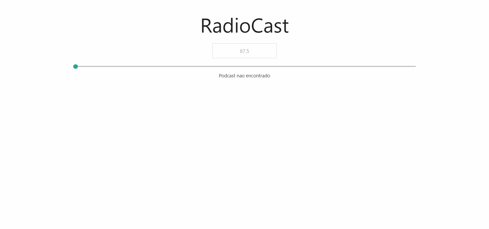

# RadioCast

## Use radio frequency in order to find the bests podcasts

RadioCast | Use radio frequency in order to find the bests podcasts

 
 

 

 

## STACK

- Javascript
- HTML
- CSS
- NodeJS

 

<blockquote alt="[ignore]">

This project is free and made for everyone!

</blockquote>

